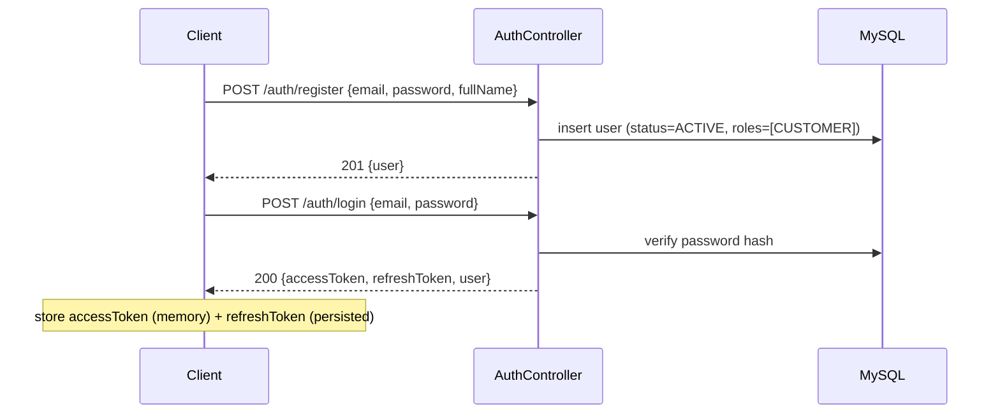
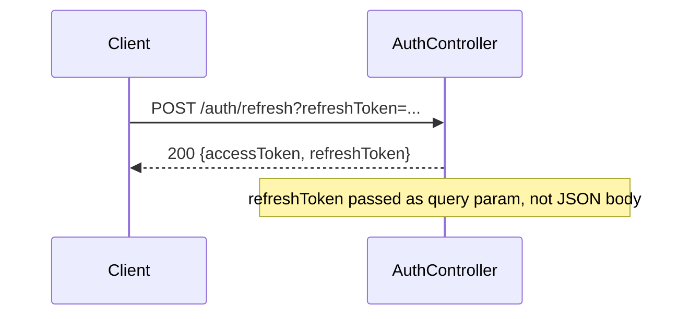
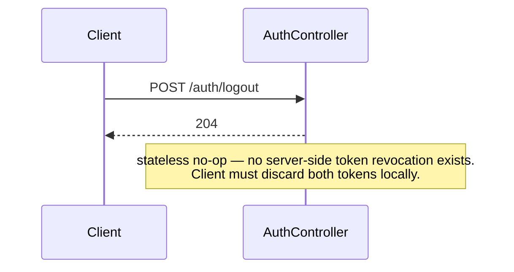
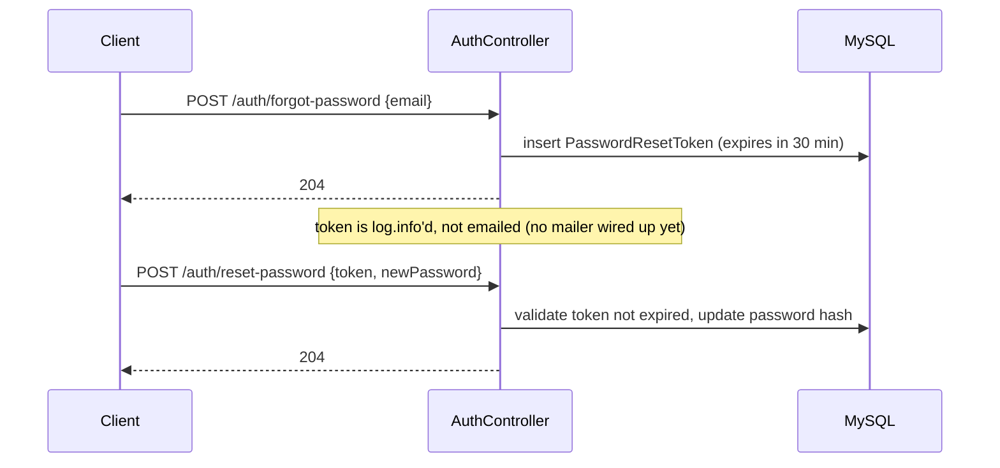
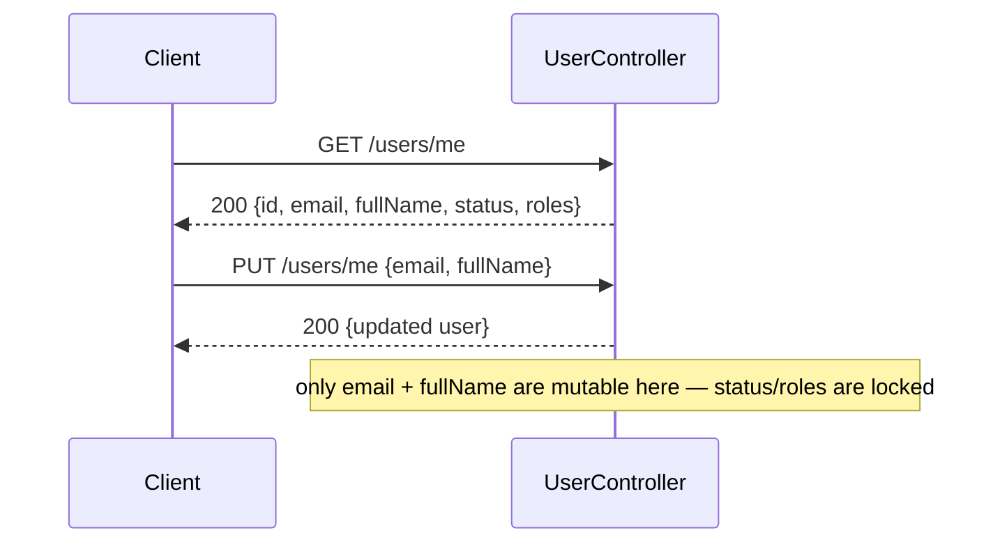
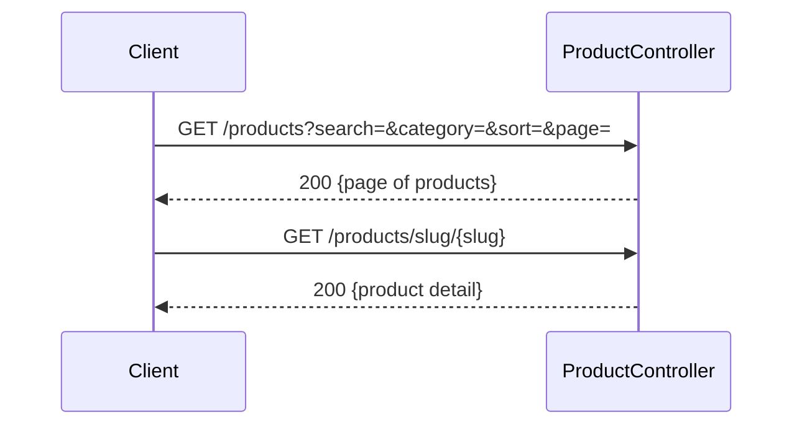
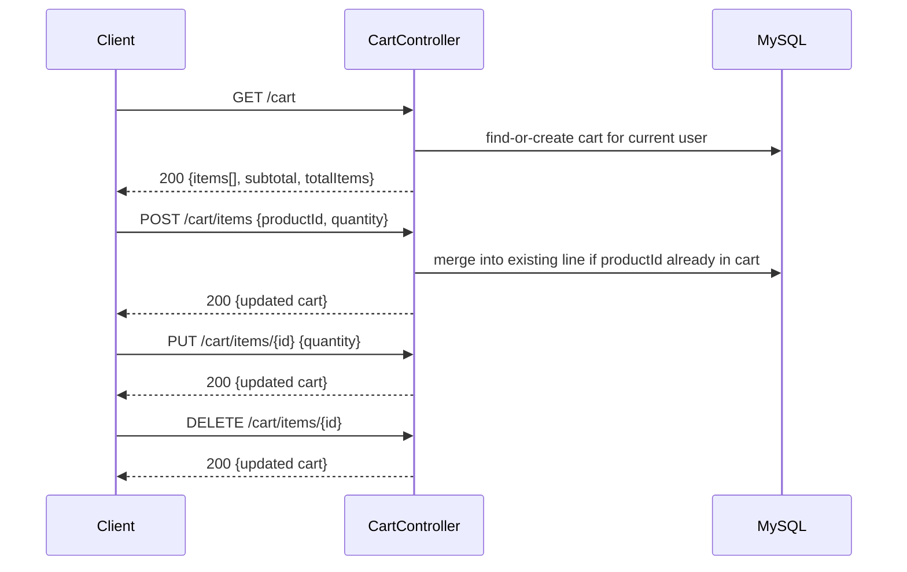
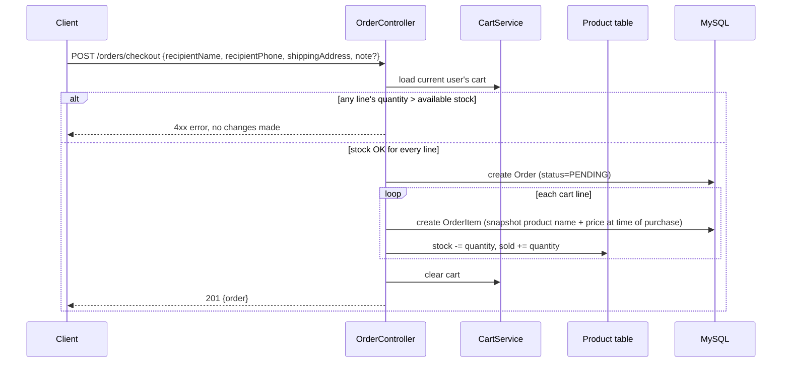
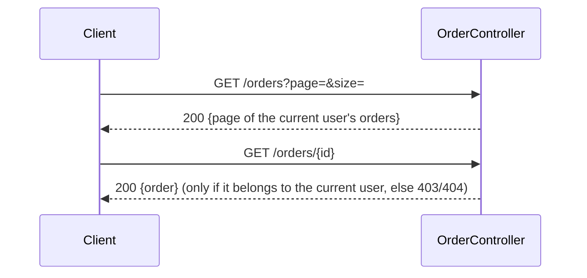

# API Flows — backend-java

Complements [API_MAP.md](API_MAP.md) (endpoint reference). This file describes the *sequence* of calls for each user journey — what happens end-to-end, in what order, and what state changes on the server.

All paths below are relative to `/api/v1` (see API_MAP.md for the base-path note).

---

## 1. Registration & Login

- Every authenticated request after this sends `Authorization: Bearer <accessToken>`.
- ⚠️ Known gap: `/auth/register` currently accepts a `roles` field (see API_MAP.md §7) — until fixed, don't let the client send arbitrary roles.

## 2. Token refresh

Client calls this reactively — on a `401` from any endpoint, refresh once, retry the original request once, then force logout on a second failure.

## 3. Session end

## 4. Forgot / reset password

## 5. Own-profile read/update

## 6. Browse products (no auth required)

## 7. Cart flow

The cart is resolved per-user automatically (`UserResolver` → `SecurityUtils.getCurrentUsername()`) — there's no explicit "create cart" call.

## 8. Checkout flow (cart → order)

- Snapshotting name/price into `OrderItem` means later price changes on the `Product` never retroactively affect a placed order.
- ⚠️ Known gap: no payment step — the order is created as `PENDING` and nothing calls `PaymentGateway`/`StubPaymentGateway`. If a payment step is added later, it slots in between "create Order" and "clear cart".

## 9. Order history

---

## Cross-cutting notes

- **Auth on every private call**: all endpoints above except register/login/refresh/forgot-password/reset-password/product-reads require a valid `Authorization: Bearer` header; a missing/expired token returns `401`, triggering the refresh flow in §2.
- **Ownership checks**: cart and order endpoints always scope to the caller's own `userId` server-side — there is no way to pass another user's ID and read their cart/orders.
- **No cross-service transactions beyond checkout**: only checkout touches multiple tables (`Cart`, `Product`, `Order`) atomically; every other flow is a single-entity read/write.
